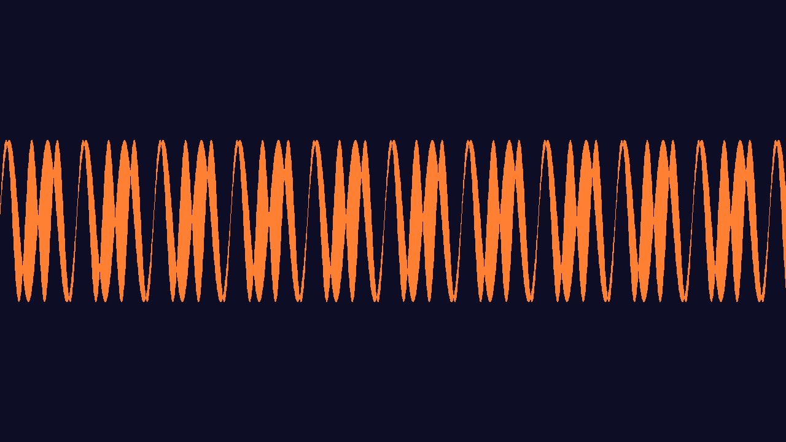

# MotionWave

[](https://github.com/FuaadBashi/MotionWave/actions/workflows/ci.yml)

A real-time audio visualiser in C++20: it plays a WAV file and draws its waveform live with
OpenGL, using SDL2 for the window and audio output.

<p align="center"></p>

## How it works

```
decoder thread ──▶ lock-free ring buffer ──▶ SDL audio callback ──▶ speakers
                                                    │
                                                    └─(mutex, copy)──▶ OpenGL renderer (60 fps)
```

- **Three threads, one direction of data.** A decoder thread converts samples to floats and
  feeds a ring buffer. SDL's real-time audio callback drains it. The render loop draws the most
  recent block.
- **Lock-free ring buffer.** A single-producer, single-consumer ring with atomic read and write
  indices and acquire/release ordering, so the audio callback never blocks on a lock and never
  glitches. It is tested with a million-sample producer/consumer run under ThreadSanitizer.
- **Back-pressure.** The decoder sleeps on a condition variable while the buffer is full and is
  woken by the callback, so it never busy-waits or runs ahead of playback.
- **Clean shutdown.** Closing the window sets a stop flag and wakes the decoder, so the app exits
  immediately rather than waiting for the track to finish.
- **Any WAV.** 8-bit, 24-bit and float files are converted to 16-bit with `SDL_AudioCVT` on load.

[`docs/Renderer.annotated.cpp`](docs/Renderer.annotated.cpp) is a line-by-line walkthrough of the
OpenGL side: shaders, VAOs, VBOs and the draw call.

## Build

Requires CMake 3.20+, a C++20 compiler, SDL2 and GLEW.

```bash
# macOS:          brew install cmake sdl2 glew
# Debian/Ubuntu:  sudo apt install cmake libsdl2-dev libglew-dev
git clone https://github.com/FuaadBashi/MotionWave.git
cd MotionWave
cmake -S . -B build -DCMAKE_BUILD_TYPE=Release
cmake --build build
./build/MotionWave path/to/song.wav
```

## Tests

```bash
ctest --test-dir build --output-on-failure
```

[MotionWavePlus](https://github.com/FuaadBashi/MotionWavePlus) is the follow-up, rebuilt on
raylib and miniaudio.
